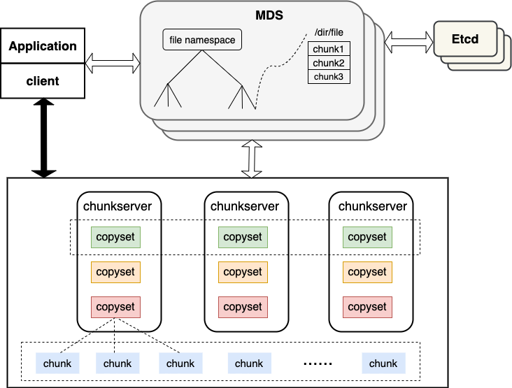

# CURVE

## What is CURVE ?

CURVE is a high-performance, high-availability and high-reliability distributed storage system independently designed and developed by NetEase, with very good scalability. Based on the storage base, storage systems suitable for different application scenarios can be built, such as block storage, object storage, cloud native database, etc. The design and development of CURVE always revolves around three concepts: one is to conform to the current development trend of storage hardware facilities, to achieve the combination of software and hardware to create top-level storage products; the second is to uphold "Simple Can be harder than complex" and choose the simplest solution to the problem under the condition of understanding the nature of the problem; the third is to embrace open source, use excellent open source project components under the premise of full research, and avoid reinventing the wheel.

At present, we have implemented a high-performance block storage system based on CURVE, which supports snapshot, clone and recover, supports two mounting methods of QEMU(virtual machine) and NBD(physical machine), and is used as a high-performance cloud disk inside NetEase.

## CURVE architecture

### Basic architecture

To have some insight into CURVE, you must first understand the overall architecture of CURVE. The CURVE cluster mainly includes three core components: MDS, Chunkserver, and Client.

#### MDS

MDS is the central node. It has two responsibilities: one is to store and manage metadata information, including system topology information, file system Namespace (tree directory structure, files and directories, directory meta information, etc.), Copyset (Raft replication group) location information. The second is to sense the cluster status and perform reasonable scheduling, including sensing Chunkserver going online and offline, collecting Chunkserver load information, cluster load balancing and fault repair. MDS uses Etcd to select masters to achieve high availability. Leader-MDS and Follower-MDS do not synchronize data. After Leader-MDS hangs, Follower-MDS loads data from Etcd and then starts the service.

#### Chunkserver

Chunkserver is the data node, responsible for data storage. The smallest unit of data storage is chunk, which supports overwriting, and the basic unit for managing data storage is Copyset. Chunkserver uses the Raft protocol for replication to maintain data consistency and disaster tolerance. Copies are managed in units of Copysets. Multiple Copysets on different nodes form a Raft Group, which are copies of each other. The load balancing of data among multiple Chunkservers is scheduled by MDS, which is scheduled in units of CopySet.

#### Client

Client provides a Posix-like file system interface to the application. It interacts with MDS to implement addition, deletion, modification, and query of metadata. It interacts with Chunkserver to implement addition, deletion, modification, and query of data, splits io, and performs specified QoS control on IOPS and bandwidth. Client also supports hot upgrades, which can make changes to the underlying version without the user's perception.

### Snapshot clone

The snapshotclone subsystem in the CURVE block storage system is independent of the CURVE core service. The snapshotclone operation is processed by a separate SnapShotCloneServer. The snapshots created by the user and will be uploaded to the S3 cluster to save storage space, and it supports both incremental and full snapshots.

## Core features

### high performance

High performance is a major feature of CURVE, and it is also our original intention to create the CURVE project. At the RPC level, CURVE uses the high-performance and low-latency open source [brpc](https://github.com/apache/incubator-brpc); at the consistency level, the quorum-based and open source [braft](https ://github.com/baidu/braft). From the protocol level, the quorum mechanism is inherently better than the multi-copy strong consistency method in terms of latency. CURVE optimizes the implementation of braft snapshots. In the implementation of the state machine, the chunkfilepool method is used (when the cluster is initialized, a specified proportion of space is formatted as chunks) so that the underlying write magnification is 0; in addition, CURVE also Perform more detailed address space hashing on chunks to achieve the effects of read-write separation and reduce IO collisions, thereby further improving IO performance.

### High availability

High availability is another major feature of CURVE. MDS, ChunkServer and SnapShotCloneServer all support multi-instance deployment. Abnormalities in some instances will not affect the availability of the entire cluster.

- **MDS**

  MDS is stateless, and it is recommended to deploy at least two instances. Multiple MDS instances are selected through Etcd. When a single instance fails, it can switch to another instance in seconds. Both the Client and SnapShotCloneServer will retry the requests being processed on the failed instance, to achieve the effect of not affecting the availability of the cluster.

- **SnapShotCloneServer**

  SnapShotCloneServer is similar to MDS. It also selects the master through Etcd. The difference is that it provides external services through load balancing. Request failure retries during the invalidation period are all idempotent and do not affect the correctness of the task and the availability of the cluster.

- **ChunkServer**

  ChunkServer is a cluster that maintains data consistency through the Raft protocol and performs load balancing through MDS. When a single node fails, all Copysets stored on this node will be affected. For the Leader node on the Copyset, the service will be interrupted and wait for re-election; for the follower node on the Copyset, the service will not be affected. When a Chunkserver node fails and cannot be recovered within a period of time, MDS will migrate the data on it to other nodes.

## Curve project

[source code in github](https://github.com/opencurve/curve)

## contact us

WeChat group: CURVE communication group

Since the CURVE communication group has more than 200 people, please add the following personal WeChat first. And then we will invite you to join the group.

